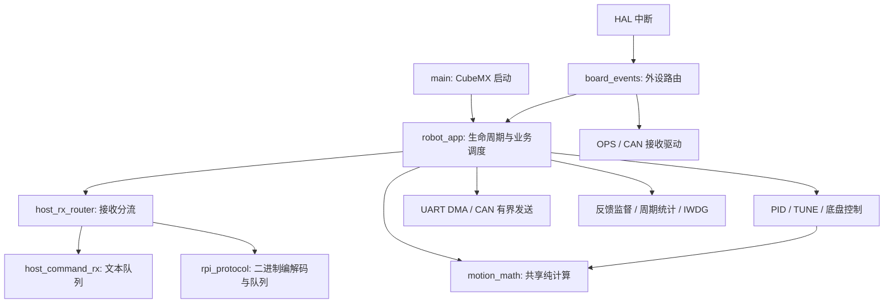

# 固件架构与维护约定

2026-09-09。本轮将 CubeMX 启动、板级回调、应用状态、接收协议和通用运动计算分开；保留现有协议、控制周期、PID 单位和安全阈值。



## 状态与调用约定

- `main.c` 只初始化 CubeMX 外设并调用 `RobotApp_Init()` 一次，随后重复调用 `RobotApp_Process()`。应用调用留在 USER CODE 区域；新增源文件必须被 CubeIDE 纳入构建。
- `robot_app.c` 是应用状态唯一所有者。PID、主机模式、目标、遥测和发送状态改为文件私有；跨 ISR 的会话心跳和主机类型显式标为 volatile。其他文件不得通过 extern 读取或改写这些状态。
- `board_events.c` 是 HAL 回调及 `_write` 的唯一适配入口。USART1 交给应用接收入口；USART2 交给 OPS；CAN1 交给 ZDT；CAN2 交给 G6220。ISR 不执行运动业务、printf 或延时。
- `HostRxRouter` 是调用者持有的协议对象，能在测试中创建多个实例。模块只识别字节、组帧和维护队列；新合法二进制帧以返回值通知应用，由应用决定是否刷新会话心跳，不读取主机模式。
- `HostRx_*` 不自行屏蔽中断，也不包含 HAL。应用在主循环出队、重置时保存/恢复 PRIMASK；ISR 调用不意外打开中断。统计值用于诊断，不能作为同步锁或安全授权。
- UART DMA 活动缓冲仍由既有发送层保持稳定；HAL 完成回调经应用路由到其所有者。不得从新模块直接写 USART1、绕过发送队列。
- `motion_math.c` 不读取 PID、OPS 或主机状态。输入为显式参数；有限值和硬限幅由控制调用者保证。POSE 与 TUNE 共享安装偏移、角度归一化、标量斜坡及坐标补偿。角度函数固定返回 `angle - reference`，调用顺序决定正方向。

应用单步保留既有顺序：处理 UART 故障 → 接收命令和发送服务 → 更新反馈 → 安全监督 → POSE/TUNE 与调试运动超时 → 反馈查询和遥测 → 周期检查/喂狗。此次没有引入 RTOS、动态内存、额外运动线程，也未更改 wire v2 / HOST v4。

## 可复现构建与 CI

`tools/build_firmware.py` 从 `Core/Src`、HAL 驱动源目录和 `Core/Startup` 收集源码，使用仓库中的 FLASH 链接脚本。对象保留相对路径，避免不同目录同名文件相互覆盖；每次重新编译并仅链接本次源码对象，不读取忽略目录中的旧清单。编译使用 `-Wall -Werror`。

```text
python -B tools/generate_rpi_protocol.py --check
python -B tools/run_c_tests.py
python -B tools/build_firmware.py --toolchain-bin <ARM-GCC-bin>
cd pi-brain
python -B -m unittest discover -s tests -t .
```

CI 分为主机回归与 ARM 构建两个任务，均在 Ubuntu 24.04 上运行。主机任务运行协议生成检查、五套 C 测试与 Pi 测试；固件任务安装 ARM GCC/newlib 后调用同一构建脚本。使用官方 [checkout](https://github.com/actions/checkout) 和 [setup-python](https://github.com/actions/setup-python)，仅授予 contents:read；不初始化 SSH 调参子模块。

本地验证：五套 C 测试、Pi 192 项通过；ARM GCC 13.3.rel1 编译链接 46 单元、零警告。接收路由测试覆盖满队列 STOP、CRC 拒绝、ASCII/二进制切换及重置撤销旧命令；运动计算测试覆盖 ±180° 环绕、完整航向范围的安装偏移、二维等比斜坡、反向减速与不超调。另有前轮控制层九组 HAL 替身场景。主机测试不能证明真实 ISR/DMA 时序或实际停车，硬件清单见 [控制层验证](control-layer-validation.md)。

## 后续拆分顺序

`robot_app.c` 仍承载 ASCII/二进制业务分派和 POSE 状态机。本轮先消除对 CubeMX 文件的依赖、共享全局状态以及重复计算；后续按以下接口边界继续拆分，避免把大量状态搬成全局 context 供所有模块任意访问：

1. 建立包含目标、限速、取消及查询的类型明确命令，ASCII/二进制只做转换，两种入口执行同一业务规则。
2. 抽出持有私有目标和阶段状态的 POSE 控制器，通过返回事件报告 STARTED/REACHED/FAULT，不在控制器中打印或编码协议。
3. 为真实固件回复维护可回放协议样本，使 Pi FakeFirmware 与固件持续核对；当前测试并未实现整机硬件仿真。

本次发布主仓库的前轮停车/控制修复和本轮架构修改。调参子模块、本机 IDE 文件、根配置及个人笔记保留原工作树状态，未纳入提交。子模块本地测试结果与 GitHub 所引用的子模块版本应分别理解。
